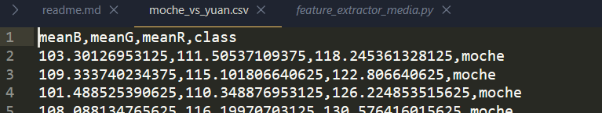

## Requerimientos
### Ingresar donde va a estar nuestro codigo y Crear e inicializar entorno virtual de Python
```
Linux: python -m venv venv
Windows: .\venv\Scripts\activate
```

### Instalar librerías de Python y Node
```
pip install -r requirements.txt
npm install
```
```
cd src
```

## Preprocesamiento con la MEDIA (cv2.mean)
### Generar vector de características de imágenes del *dataset* con la media.
```
python feature_extractor_media.py --dataset moche_vs_yuan
```
<p align="center">
  
</p>
<p align="center">
  
</p>

### Generar vector de características de una imagen de entrada con la media.

#### Con 3 vecinos
Una ceramica yuan:
<p align="center">
  
  
</p>

<p align="center">
  
</p>

```
python feature_extractor_one_media.py --image test2/1.png
```
<p align="center">
  
</p>

Una ceramica moche:
<p align="center">
  
  
</p>
<p align="center">
  
</p>

```
python feature_extractor_one_media.py --image test2/7.png
```
<p align="center">
  
</p>

#### Con 50 vecinos
Una ceramica moche:
<p align="center">
  
</p>

Una ceramica yuan:
<p align="center">
  
</p>

### Ejecución
```
node kdtree_media.js
```

## Preprocesamiento Media y Desviación Estándar (cv2.meanStdDev)

### Generar vector de características de imágenes del *dataset* .
```
python feature_extractor_STD.py --dataset moche_vs_yuan
```
<p align="center">
  
</p>

### Generar vector de características de una imagen de entrada .
#### Con 3 vecinos
Una ceramica yuan:
```
python feature_extractor_one_STD.py --image test2/1.png
```
<p align="center">
  
</p>

Una ceramica moche:
```
python feature_extractor_one_STD.py --image test2/7.png
```
<p align="center">
  
</p>

### Ejecución
```
node kdtree_STD.js
```
### Contraste con solo la media:
Utilizamos una imagen en el medio de las tonalidades.
<p align="center">
  
</p>

Con 50 vecinos
#### cv2.mean
<p align="center">
  
</p>

#### cv2.meanStdDev
<p align="center">
  
</p>

salir deactivate
